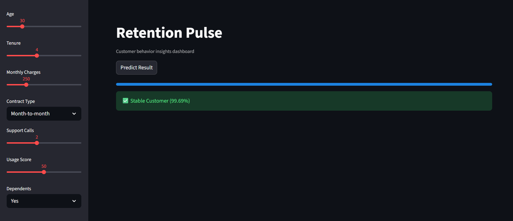

# 📊 Retention Pulse – Customer Churn Prediction

A machine learning web app that predicts whether a customer is likely to **leave (churn)** or **stay**. It is built with **Python, scikit-learn and Streamlit**. Adjust the customer details in the sidebar, click **Predict Result**, and see the churn risk as a percentage.



---

## ✨ Features

- Interactive sidebar with sliders and dropdowns for customer details
- Predicts **Churn** or **Stable** using a trained Logistic Regression model
- Shows churn probability and retention probability as percentages
- Colour-coded result: ⚠️ red for high churn risk, ✅ green for a stable customer
- Progress bar animation while the prediction runs
- Graceful error message if the model file cannot be loaded

## 🧠 How the Model Works

The model is a **Logistic Regression** classifier (`Logistic_model.pkl`) trained on customer data to predict the `Churn` column (Yes / No).

- The categorical columns were **one-hot encoded**, giving 45 input features in total
- The app builds a row with exactly those 45 columns (`model.feature_names_in_`), fills in the values chosen by the user, and sets everything else to 0
- The model returns the predicted class (`0` = stays, `1` = churns) and the probability of each class

## 📊 Dataset

The model uses `customer_churn_prediction_dataset.csv`, a telecom-style customer dataset with **300 customers** and 21 columns (139 churned, 161 stayed).

| Type | Columns |
|------|---------|
| Customer info | gender, SeniorCitizen, Partner, Dependents |
| Account info | tenure, Contract, PaperlessBilling, PaymentMethod, MonthlyCharges, TotalCharges |
| Services | PhoneService, MultipleLines, InternetService, OnlineSecurity, OnlineBackup, DeviceProtection, TechSupport, StreamingTV, StreamingMovies |
| **Target** | **Churn** (Yes / No) |

## 🎛️ App Inputs

| Input | Type | Range / Options |
|-------|------|-----------------|
| Age | Slider | 18 – 80 |
| Tenure | Slider | 0 – 10 |
| Monthly Charges | Slider | 0 – 1000 |
| Contract Type | Dropdown | Month-to-month, One year, Two year |
| Support Calls | Slider | 0 – 5 |
| Usage Score | Slider | 0 – 100 |
| Dependents | Dropdown | Yes, No |

## 🛠️ Tech Stack

| Technology | Purpose |
|------------|---------|
| Python 3 | Core language |
| Pandas | Building the model input |
| scikit-learn | Logistic Regression model |
| Joblib | Saving and loading the model |
| Streamlit | Web interface |

## 📁 Project Structure

```
├── mlprject2.py                          # Streamlit app (final version)
├── Project1.py                           # Earlier version of the app
├── Logistic_model.pkl                    # Trained Logistic Regression model
├── customer_churn_prediction_dataset.csv # Dataset
├── requirements.txt                      # Dependencies
├── app_screenshot.png                    # Screenshot
└── README.md
```

## 🚀 Getting Started

### 1. Clone the repository

```bash
git clone https://github.com/<your-username>/<your-repo-name>.git
cd <your-repo-name>
```

### 2. Install dependencies

```bash
pip install -r requirements.txt
```

### 3. Run the app

```bash
streamlit run mlprject2.py
```

The app opens in your browser at `http://localhost:8501`.

> **Note:** The model was saved with scikit-learn **1.6.1**. Using the same version (as in `requirements.txt`) avoids version-mismatch warnings when loading the `.pkl` file.

## 📖 How to Use

1. Set the customer details using the sidebar.
2. Click **Predict Result**.
3. Read the result:
   - ⚠️ **High Churn Risk** means the customer is likely to leave
   - ✅ **Stable Customer** means the customer is likely to stay
4. Check the **Prediction Details** section for churn probability, retention probability and the final prediction.

## ⚠️ Notes & Limitations

- The trained model uses the full set of 45 features, but the app only collects a few of them. The remaining features are set to `0`, so predictions are approximate.
- Only **Tenure, Monthly Charges, Contract Type and Dependents** match columns in the trained model. **Age, Support Calls and Usage Score** are not part of the model's training columns, so they do not change the prediction yet.
- The dataset is small (300 rows), so results should be treated as a demo, not a production-ready prediction.

## 🔮 Future Improvements

- Retrain the model with only the features collected in the app (or collect all of them)
- Use a larger dataset and add model evaluation scores (accuracy, precision, recall)
- Add charts showing which factors drive churn
- Try other models such as Random Forest or XGBoost
- Deploy online with Streamlit Community Cloud

## ⚠️ Disclaimer

This project is for learning and educational purposes only.

## 👨‍💻 Author

Made by **<Your Name>**
GitHub: [@<your-username>](https://github.com/<your-username>)

---

⭐ If you like this project, give it a star!
